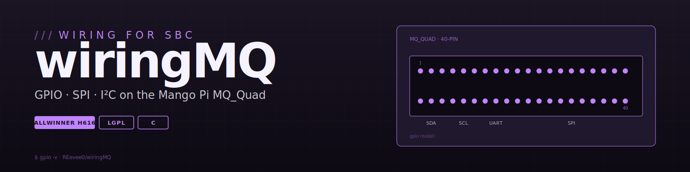

# wiringMQ



[](COPYING.LESSER)


GPIO / SPI / I²C library for the **Mango Pi MQ_Quad** single-board computer.
Ports [WiringPi](http://wiringpi.com) and [WiringOP](https://github.com/orangepi-xunlong/wiringOP)
to the H616 SoC, so existing WiringPi code Just Works™ on MQ_Quad.

> The MQ_Quad ships with an OS image based on Orange Pi Zero 2 (same H616 SoC),
> so most of the porting work is around correctly mapping MQ_Quad's 40-pin header
> to the H616's GPIO banks.

## Why this exists

MQ_Quad had no WiringPi port available, which made using familiar C APIs difficult on this board. The existing Orange Pi Zero 2 wiringOP was close since both boards use the same H616 SoC, but its 40-pin header mapping didn't match MQ_Quad's physical layout. This project fixes that mismatch so your existing WiringPi C code works verbatim without any pin number changes.

## Features

- ✅ GPIO read / write / mode
- ✅ SPI (with `overlays=spi-spidev`)
- ✅ I²C bus 3 (with `overlays=i2c3`)
- ✅ UART 5
- ✅ Drop-in compatible with WiringPi C API
- 🚧 Other comm protocols — more testing to come

## Install

> Run on the **Linux image compiled by showsoft**:
> https://github.com/showsoft/Mangopi-MQQuad-srv

```sh
sudo apt-get update
sudo apt-get install -y git
git clone https://github.com/REevee0/wiringMQ.git
cd wiringMQ
./build clean
sudo ./build
```

## Quick start

```c
#include <wiringPi.h>

int main(void)
{
    wiringPiSetup();
    pinMode(2, OUTPUT);       // PI0 (header pin 7)

    for (;;) {
        digitalWrite(2, HIGH);
        delay(500);
        digitalWrite(2, LOW);
        delay(500);
    }
}
```

Build with `gcc blink.c -lwiringPi -o blink`.

## The output of the `gpio readall` command

```
 +------+-----+----------+------+---+ MQ_Quad  +---+------+----------+-----+------+
 | GPIO | wPi |   Name   | Mode | V | Physical | V | Mode | Name     | wPi | GPIO |
 +------+-----+----------+------+---+----++----+---+------+----------+-----+------+
 |      |     |     3.3V |      |   |  1 || 2  |   |      | 5V       |     |      |
 |  264 |   0 |  PI8/SDA |  OUT | 0 |  3 || 4  |   |      | 5V       |     |      |
 |  263 |   1 |  PI7/SCL |  OUT | 0 |  5 || 6  |   |      | GND      |     |      |
 |  256 |   2 |      PI0 |  OUT | 1 |  7 || 8  | 1 | OUT  | TXD.0    | 3   | 224  |
 |      |     |      GND |      |   |  9 || 10 | 1 | OUT  | RXD.0    | 4   | 225  |
 |  226 |   5 |     TX.5 |  OUT | 1 | 11 || 12 | 1 | OUT  | PI1      | 6   | 257  |
 |  227 |   7 |     RX.5 |  OUT | 1 | 13 || 14 |   |      | GND      |     |      |
 |  269 |   8 |     PI13 | ALT2 | 0 | 15 || 16 | 0 | ALT2 | PI14     | 9   | 270  |
 |      |     |     3.3V |      |   | 17 || 18 | 0 | OFF  | PH4      | 10  | 228  |
 |  231 |  11 |   MOSI.1 |  OFF | 0 | 19 || 20 |   |      | GND      |     |      |
 |  232 |  12 |   MISO.1 |  OFF | 0 | 21 || 22 | 0 | OFF  | PI6      | 13  | 262  |
 |  230 |  14 |   SCLK.1 |  OFF | 0 | 23 || 24 | 0 | (null) | CS.0     | 15  | 229  |
 |      |     |      GND |      |   | 25 || 26 | 0 | (null) | CS.1     | 16  | 233  |
 |  266 |  17 |     PI10 | ALT2 | 0 | 27 || 28 | 0 | ALT2 | PI9      | 18  | 265  |
 |  267 |  19 |     PI11 | ALT2 | 0 | 29 || 30 |   |      | GND      |     |      |
 |  268 |  20 |     PI12 | ALT2 | 0 | 31 || 32 | 0 | ALT2 | PI5      | 21  | 261  |
 |  271 |  22 |     PI15 | ALT2 | 0 | 33 || 34 |   |      | GND      |     |      |
 |  258 |  23 |      PI2 | ALT2 | 0 | 35 || 36 | 0 | ALT3 | PH10     | 24  | 234  |
 |  272 |  25 |     PI16 | (null) | 0 | 37 || 38 | 0 | ALT2 | PI4      | 26  | 260  |
 |      |     |      GND |      |   | 39 || 40 | 0 | ALT2 | PI3      | 27  | 259  |
 +------+-----+----------+------+---+----++----+---+------+----------+-----+------+
 | GPIO | wPi |   Name   | Mode | V | Physical | V | Mode | Name     | wPi | GPIO |
 +------+-----+----------+------+---+  MQ_Quad +---+------+----------+-----+------+
```

## Building

The library builds into two shared objects: `libwiringPi.so` and `libwiringPiDev.so`. It also compiles the `gpio` CLI tool, which mirrors the original WiringPi command-line interface for familiar usage.

## Compared to alternatives

| Feature | wiringMQ (this repo) | WiringOP (Orange Pi Zero 2) | sysfs GPIO |
|---------|---------------------|----------------------------|------------|
| MQ_Quad pinout | ✅ Correct mapping | ❌ Wrong header mapping | N/A |
| GPIO speed | Fast, optimized | Fast, optimized | Slower |
| SPI/I²C helpers | Built-in | Built-in | Manual setup |
| existing wiringPi code works | ✅ Verbatim | ⚠️ Pin numbers differ | ❌ Requires rewrite |

## Contributing

PRs are welcome! I'm especially interested in testing other H616 communication blocks like PWM, additional UARTs, and SPI0/I²C0/I²C1. If you have experience with these peripherals, your contributions would be greatly appreciated.

## Roadmap

- [ ] PWM via H616 timer block
- [ ] Hardware UART beyond UART5
- [ ] Test SPI0 / I²C0 / I²C1
- [ ] CI for build sanity

## Credits

- [WiringPi](http://wiringpi.com) — original API, Gordon Henderson
- [WiringOP](https://github.com/orangepi-xunlong/wiringOP) — Orange Pi port
- [showsoft/Mangopi-MQQuad-srv](https://github.com/showsoft/Mangopi-MQQuad-srv) — MQ_Quad Linux image

## License

LGPL — see [COPYING.LESSER](COPYING.LESSER).
